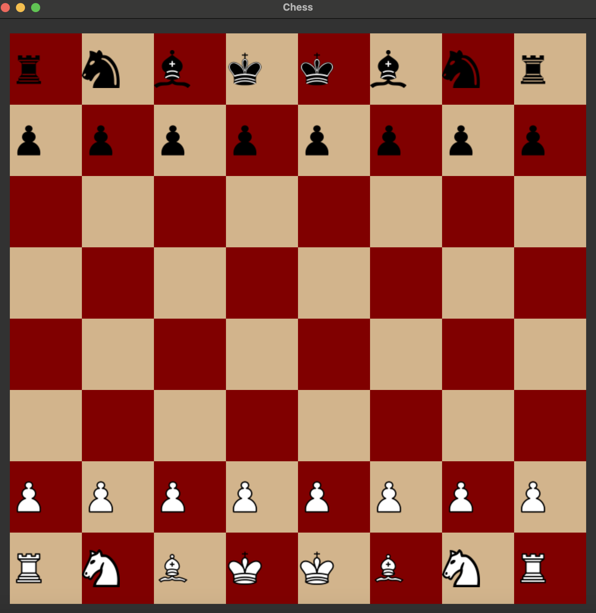
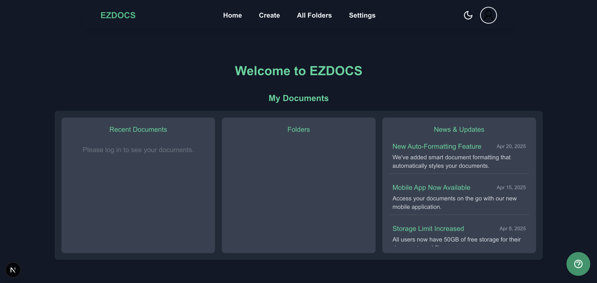

# Alex Cole

## About Me
Hi, I'm Alex Cole — a passionate and driven Computer Science student at the University of St. Thomas, pursuing a B.S. in Computer Science.  
My interests include Software Engineering, Data Science, and Cyber Security. I enjoy building things that solve real-world problems and collaborating with others to learn and grow.

## Skills

### 🖥️ Technical Skills
- Languages & Frameworks: Java, C++, C#/.NET, Python, Next.js, TypeScript, TailwindCSS, SQL
- Tools: Git, GitHub, Visual Studio, VSCode, PostgreSQL, SQLite, Qt Creator

### 💡 Soft Skills
- Analytical thinking
- Creative problem solving
- Logical reasoning
- Troubleshooting under pressure
- Technical communication
- Time management
- Collaboration and teamwork

## Projects

---

### ♟️ C++ Chess Project
**Description:**  
A fully functional chess application built with C++ and Qt. The program supports move validation, check/checkmate logic, and a clean GUI for gameplay.

**Figure:**  
 <!-- Replace with actual image path if available -->

**Keywords:** `C++`, `Qt`, `Chess Engine`, `OOP`, `GUI`, `Game Logic`

---

### 📄 EZDocs AI Documentation Tool
**Description:**  
A web-based documentation assistant designed to help entry-level IT professionals and software engineers create clean and readable technical documentation using AI.  
Built using Next.js, TypeScript, TailwindCSS, Python (FastAPI), and PostgreSQL. AI integration powered by OpenAI API.

My contributions included building the rich text editor, connecting the editor to openAI through the API, and building the database. 

**Figure:**  
 <!-- Replace with actual image path -->

**Keywords:** `Next.js`, `TypeScript`, `TailwindCSS`, `FastAPI`, `PostgreSQL`, `AI`, `OpenAI`, `Full Stack`

---

## 📄 Resume

[Click here to view my resume (PDF)](./resume.pdf)
